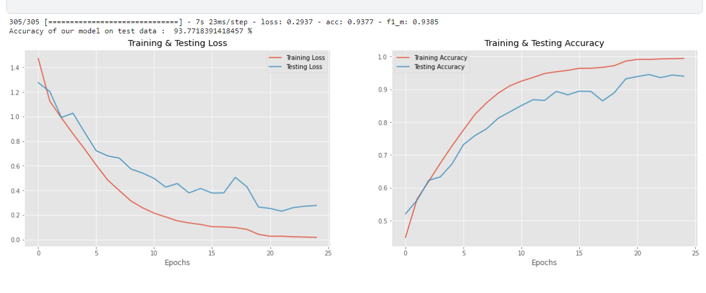

# Speech Emotion Recognition 

 
## **Description**   
The project is about creating a model that can recognize emotions based on an input audio signal. <br />
The model can recognize the following emotions:-
- Anger
- Disgust
- Fear
- Happiness
- Neutral
- Sadness
- Surprise

the model was trained on 4 popular datasets found on 
[Kaggle](https://www.kaggle.com/datasets/dmitrybabko/speech-emotion-recognition-en)

## **How to run**   
First, install dependencies found in `requirements.txt`


```bash   
pip install -r requirements.txt
 ```
Then
from the `main_script` call the predict function with needed paths


**Example**

```
trained_model_path = './models/res_model.h5'

weights_path = './models/model_weights.h5'

samples_path = './test_samples'

scaler_model_path = './scaler.pkl'

predict(samples_path, trained_model_path, weights_path, scaler_model_path)

```

**sample output** <br />
1/1 [==============================] - 0s 353ms/step  <br />
the model predicted  **sad**  and the true label was  **sad**  <br />

1/1 [==============================] - 0s 120ms/step <br />
the model predicted  **angry**  and the true label was  **angry**  <br />

1/1 [==============================] - 0s 123ms/step <br />
the model predicted  **neutral**  and the true label was  **disgust** <br />
<br />
_________________________________________________________________________________________ 
<br />

Another way to follow up is to look through the `pipline.ipynb` found in notebooks folder <br />
this is the kaggle notebook I used to train the model and save its weights

_________________________________________________________________________________________ 
<br />

## Model Summary
```
Model: "sequential"
_________________________________________________________________
Layer (type)                 Output Shape              Param #   
=================================================================
conv1d (Conv1D)              (None, 2376, 512)         3072      
_________________________________________________________________
batch_normalization (BatchNo (None, 2376, 512)         2048      
_________________________________________________________________
max_pooling1d (MaxPooling1D) (None, 1188, 512)         0         
_________________________________________________________________
conv1d_1 (Conv1D)            (None, 1188, 512)         1311232   
_________________________________________________________________
batch_normalization_1 (Batch (None, 1188, 512)         2048      
_________________________________________________________________
max_pooling1d_1 (MaxPooling1 (None, 594, 512)          0         
_________________________________________________________________
conv1d_2 (Conv1D)            (None, 594, 256)          655616    
_________________________________________________________________
batch_normalization_2 (Batch (None, 594, 256)          1024      
_________________________________________________________________
max_pooling1d_2 (MaxPooling1 (None, 297, 256)          0         
_________________________________________________________________
conv1d_3 (Conv1D)            (None, 297, 256)          196864    
_________________________________________________________________
batch_normalization_3 (Batch (None, 297, 256)          1024      
_________________________________________________________________
max_pooling1d_3 (MaxPooling1 (None, 149, 256)          0         
_________________________________________________________________
conv1d_4 (Conv1D)            (None, 149, 128)          98432     
_________________________________________________________________
batch_normalization_4 (Batch (None, 149, 128)          512       
_________________________________________________________________
max_pooling1d_4 (MaxPooling1 (None, 75, 128)           0         
_________________________________________________________________
flatten (Flatten)            (None, 9600)              0         
_________________________________________________________________
dense (Dense)                (None, 512)               4915712   
_________________________________________________________________
batch_normalization_5 (Batch (None, 512)               2048      
_________________________________________________________________
dense_1 (Dense)              (None, 7)                 3591      
=================================================================
Total params: 7,193,223
Trainable params: 7,188,871
Non-trainable params: 4,352
```

## Results


<br />
the model got an accuracy of **93** % on the test dataset 

## References

[Kaggle](https://www.kaggle.com/datasets/dmitrybabko/speech-emotion-recognition-en)
<br />
[EDA](https://www.kaggle.com/code/dmitrybabko/speech-emotion-recognition-conv1d)

